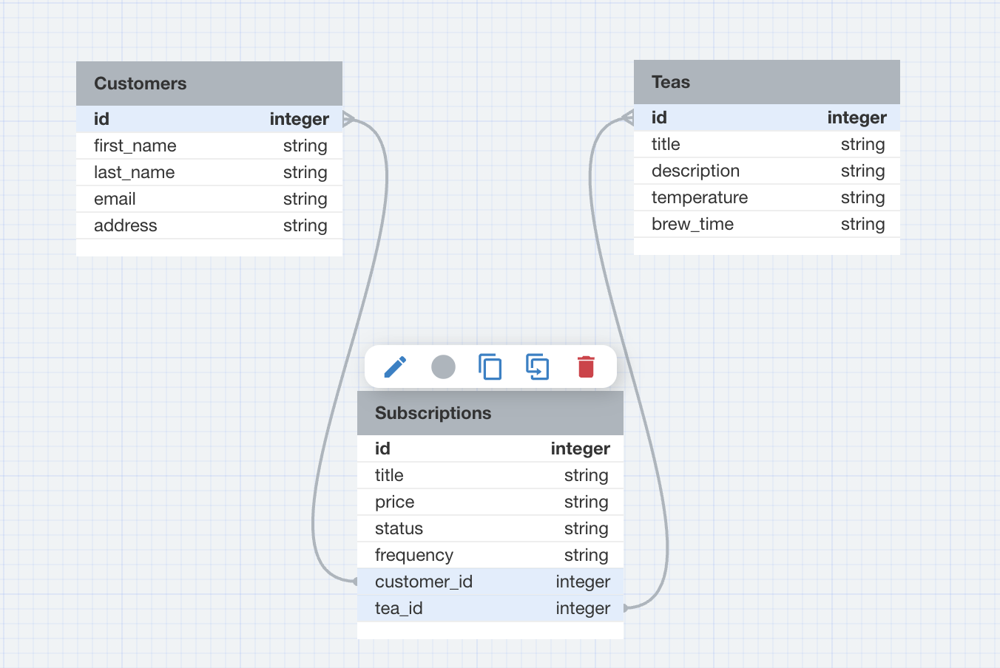

# Tea Service

## About This Project
### Important to Note

This is a back end repository for a back end application. The back end repository can be found:

[ ](https://github.com/angelbyun/tea_service)

### Mod 4 Take Home Project

Tea_Service is an app that allows users to subscribe to different teas. Users are able to cancel their tea subscriptions at any time and can change the frequency of their tea delivery from weekly to monthly and vice versa. Users are able to also view all of their tea subscriptions on their dashboard, both active and canceled.

## Purpose

The purpose of the back end appp for Tea_Service is to build API endpoints which stores a many-to-many database for customers, teas, and subscriptions. Customers and teas are able to have a relationshp through subscriptions.

The overall purpose of the back end application is to support seamless data management. It plays a vital role in ensuring the app's functionality, enhancing the xperience of users looking to subscribe to different types of teas that can be delivered to them.

## Built With


## Getting Started

1. Fork the project
2. Clone the repository
```
git clone https://github.com/angelbyun/tea_service
```
## Endpoints Used

<div style="overflow: auto; height: 200px;">
  <pre>
    <code>
      POST '/subscribe' - Add Subscription
      PATCH '/unsubscribe' - Cancel Subscription
      GET '/subscriptions' - All Subscriptions
    </code>
  </pre>
</div>

## Response

<div style="overflow: auto; height: 200px;">
  <pre>
    <code>

    Add Subscription

    {
    "data": {
        "id": "1",
        "type": "subscription",
        "attributes": {
            "title": "Hibiscus",
            "price": "12.00",
            "status": "Active",
            "frequency": "Monthly",
            "customer_id": 1,
            "tea_id": 3
        }
    }
}

Cancel Subscription

{
    "data": {
        "id": "1",
        "type": "subscription",
        "attributes": {
            "title": "Hibiscus",
            "price": "12.00",
            "status": "Canceled",
            "frequency": "Monthly",
            "customer_id": 1,
            "tea_id": 3
        }
    }
}

All Subscriptions

{
  "data": {
    [
      "id": "1"
      "type": "subscription"
      "attributes": {
        "title": "Hibiscus",
        "price": "12.00",
        "status": "Active",
        "frequency": "Monthly",
        "customer_id": 1,
        "tea_id": 3
      },
      {
        "title": "Butterfly Pea",
        "price": "15.00",
        "status": "Active",
        "frequency": "Yearly",
        "customer_id": 1,
        "tea_id": 4
      },...
    ]
  }
}
    </code>
  </pre>
</div>

## Schema



## Authors

* Angel Byun [ ](https://https://github.com/angelbyun) [ ](www.linkedin.com/in/angel-byun)